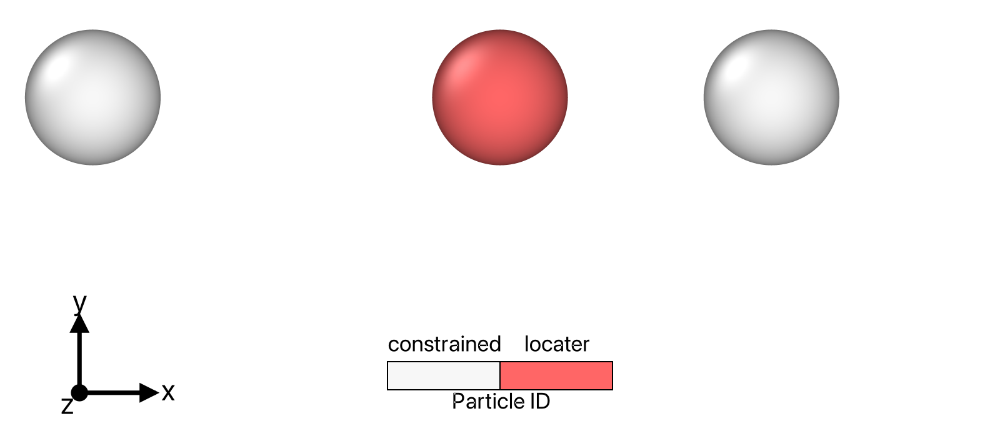

# README: Bodies in Potential Flow

Study dynamics of inertial active matter in potential flow (irrotational, incompressible).

Author: [Alec Glisman](https://github.com/alec-glisman)

[](https://www.codefactor.io/repository/github/alec-glisman/bodies-in-potential-flow)
[](https://github.com/alec-glisman/bodies-in-potential-flow/actions/workflows/test.yml)
[](https://codecov.io/gh/alec-glisman/bodies-in-potential-flow)



## Code documentation

Code is documented using [Doxygen](https://www.doxygen.nl/index.html) and can be found in the [`docs`](docs) directory.
Open the documentation locally via opening the [main index page](docs/html/index.html).

## Docker integration

The project can be built and run inside a Docker container.
The `docker-compose.yml` file will specify all build options and `Dockerfile` builds the image using a Ubuntu 20.04 base image.
Data I/O is handled automatically with an attached volume.

Commands:

```[shell]
docker-compose --env-file [docker_environment_file] up --detach  # build
docker-compose down                                              # tear down
```

## Project structure: links to relevant readme files

`.vscode`: [Files relevant for developing the project in VSCode.](.vscode/)
`data_tag`: Data relevant for validating results for a selection of git tags.  
`include`: External dependencies required for the project.
Further information can be found at the end of this readme.  
`input`: Data files that are used in Perl scripts to modify parameters of interest across a range of simulations.  
`profile`: [Scripts to profile code on various platforms and find performance improvement areas.](profile/README.md)  
`python`: [Python scripts to generate GSD files to input to simulation as well as analyze GSD files output from simulation.](python/README.md)  
`requirements`: [Files and scripts relevant for loading C++, Perl, and Python dependencies.](requirements/README.md)  
`scripts`: Perl scripts to run many simulations simultaneously and analyze the results.  
`src`: [C++ code for the simulation.](src/README.md)  
`test`: [C++ code containing unit test for simulation.](test/README.md)

## Data I/O

All data is input and output from simulation using the [HOOMD GSD format](https://gsd.readthedocs.io/en/stable/index.html).
The [schema](https://gsd.readthedocs.io/en/stable/python-module-gsd.fl.html) is well-documented.

I will be making a few modifications and make extensive use of the `log` section of the schema to save additional data.
Many variables are stored as floats, but I output a number of variables as doubles in the logs section for accuracy in further computations.

Frame 0 is created using a Python script and passed into the C++ simulation.
The simulation then updates parameters (such as kinematics), and outputs the "true" initial frame as Frame 1.
For this reason, there could be issues when loading data from frame 0 and any data that is not an input parameter should not be used for further work.

## Modify repository for other potential flow systems

The simulation system can be readily adapted for other configurations and constraints.

The code that must be changed inside the C++ framework is tagged with comments of the form `@review_swimmer` and are found in the Doxygen documentation page named "Altering Swimmer Design List".
The relevant classes to modify are the [`systemData`](src/simulation_system/systemData.hpp) and [`GSDUtil`](src/data_io/GSDUtil.hpp).

Separate Python scripts for GSD initialization and numerical analysis must also be generated.
These can be found in [`python/initial_configurations`](python/initial_configurations) and [`python/analysis`](python/analysis) directories, respectively.

## External dependencies

Further information found in [`requirements`](requirements/README.md) directory readme.

### Software tested

- ZSH v5.8
- Intel oneAPI v2021.1.1
- CUDA v11.3
- CMake v3.16.3
- GCC v11.1.0
- Python (Miniconda3) v3.9.5
- Perl v5.30.0

### Must install separately

#### vcpkg

- [Eigen3](https://gitlab.com/libeigen/eigen) (3.4.0): Linear algebra
- [spdlog](https://github.com/gabime/spdlog) (v1.9.1): Logging
- [Catch2](https://github.com/catchorg/Catch2) (v2.13.6): Unit testing

Manifest is found at base of repository and command `vcpkg/./vcpkg install` will manage installation.
Note that the [vcpkg Intel MKL](https://vcpkg.info/port/intel-mkl) will only verify MKL is installed and not install it on its own.
Therefore, oneAPI must still be downloaded and installed manually.

#### Intel OneAPI

- [Intel MKL](https://software.intel.com/content/www/us/en/develop/tools/oneapi/components/onemkl.html#gs.7owc4e) (oneAPI v2021.1.1): Optimized mathematical instructions
- [Intel TBB](https://www.intel.com/content/www/us/en/developer/tools/oneapi/onetbb.html#gs.ds0y09) (oneAPI v2021.1.1): Parallel computing on multi-core processors

#### Included with compiler

- [OpenMP](https://www.openmp.org/) (4.5): Multi-platform shared-memory multiprocessing programming
